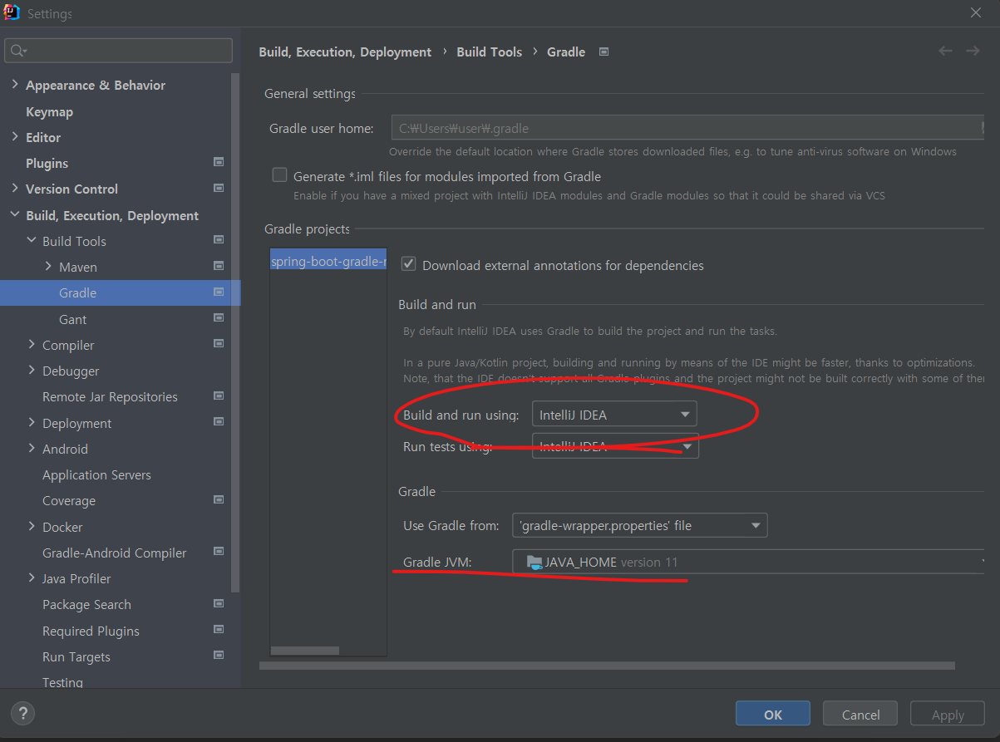
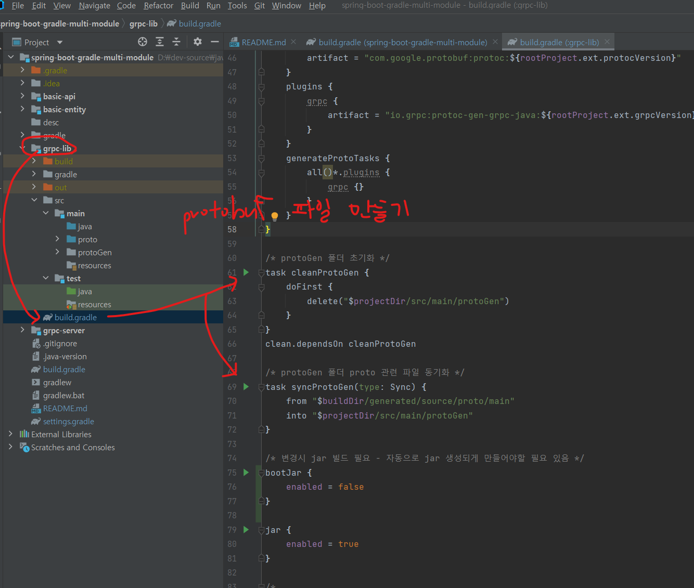
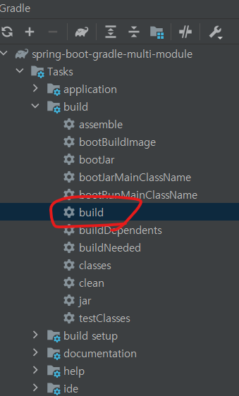
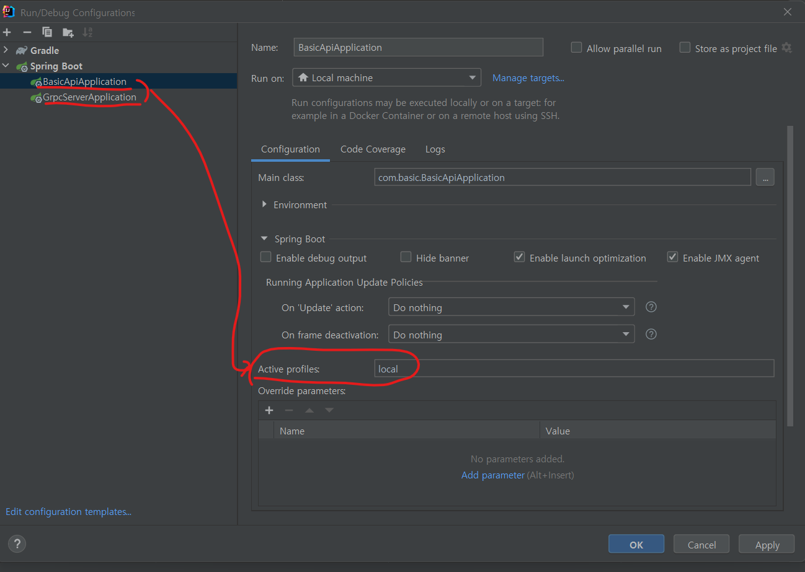

# spring-boot-gradle-multi-module 
1. 목적 : gradle multi module + grpc skeleton code 작성하여. 사용법 습득
2. 참고 레퍼런스
    1. [Spring Boot Multi Module, Gradle, JPA](https://youngthugg.tistory.com/37)
    2. [Gradle 기반 멀티 모듈 구성하기](https://cheese10yun.github.io/gradle-multi-module/)
    3. [GRPC documentation](https://grpc.io/docs/languages/java/)
    4. [Grpc 사용법](https://velog.io/@chb1828/Spring-boot%EB%A1%9C-Grpc%EB%A5%BC-%EC%82%AC%EC%9A%A9%ED%95%B4%EB%B3%B4%EC%9E%90)
    5. [공공 open api 사용](https://oopsys.tistory.com/265)


## 로컬 환경 설정
* intellij
    1. before build (```SDK version : openjdk 11```)
       1. file > settings > build > gradle 설정
          > 
       2. 공통모듈로 사용할 grpc protobuf 파일 생성 
          > 
    2. build
       1. build 실행
          > 
       2. build error
          ````
          터미널에서 build 오류시 - gradle invalid source release: 11
          - gradle.properties 생성 후 본인의 java home 추가
          - 예시 : org.gradle.java.home=C:\\Program Files\\ojdkbuild\\java-11-openjdk-11.0.13-1 
          ````
    3. after build
       > 


## 개발 적용 사항
* spring-boot 2.4.11
    * spring 관련 기본 설정들
        1. mybatis + jpa + multi db instance 적용
            1. mybatis - xml
            2. jps - repository
            3. hikari multi db instance 설정
        2. lombok
        3. logback-spring - logback 설정
        4. properties - cutsom properties 설정 불러와 사용
        5. custom banner - init banner 설정
        6. spring profile - 배포를 위한 환경별 프로파일 설정 (application.yml, application-dev.yml)
        7. gitignore - 불필요한 커밋 파일 제외 설정
        8. 기본 config 설정
            1. WebMvcConfigurer 설정
            2. Filter 설정
            3. interceptor 설정
    * test case
        1. .http 파일로 test case 작성
    * gradle
        1. gradle multi module 사용
        2. dependency 및 jar 생성을 위한 내용 작성
        3. grpc-protobuf 설정
      
* restful-api
    * restful sample api 개발

* grpc server/client/lib 구성
  * grpc-server 구성
    * hello sample api
    * weather api (정부 open api 연동)
      - [기상청_수치모델자료(경량화) 조회서비스](https://www.data.go.kr/data/15043588/openapi.do)
    

